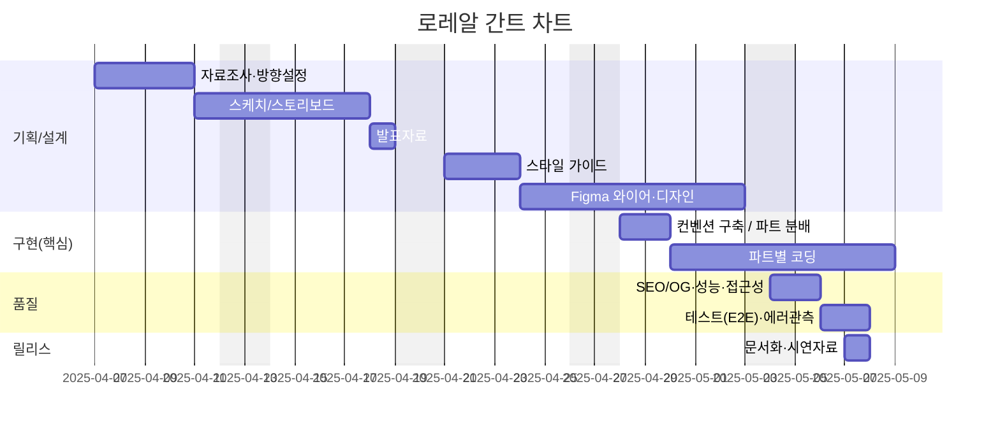

# 로레알 코리아 홈페이지 리뉴얼 프로젝트

## 🔗 빠른 링크
- **📑기획서(피그마 PPT Slide)**:[figma Slides](https://www.figma.com/deck/dsNqJRiqx2yZj6nN1fsHGp/1%EC%B0%A8-%EB%A1%9C%EB%A0%88%EC%95%8C-%EB%A6%AC%EB%89%B4%EC%96%BC-PPT?node-id=1-805&t=3mhFodHZRL7Ie5dS-1)
- **🌐배포 URL**: [로레알코리아](https://kyt0830.github.io/project01/)
- **🔗GitHub:** [로리알코리아](https://github.com/kyt0830/project01)  

---

## 1. 프로젝트 개요

### 1.1 목표
- **디자인 개선 및 UI/UX개선**: 내국인에게 친숙한 레이아웃 구조로 재설계, 접근성과 가독성을 높이고 사용자 흐름이 매끄럽도록 사용성을 개선한다.
- **정적 웹 페이지 개발**: 프론트엔드 과정 초반 학습 내용을 바탕으로 HTML, CSS, JavaScript만으로 1차 버전 구현, 가볍고 빠른 로딩 속도 제공


### 1.2 👥 팀원
| 이름 | 역할 | 주요 담당 | GitHub | 연락 |
| --- | --- | --- | --- | --- |
| 김영태 | 팀장 · 공통 | 프로젝트 기획, 메인 페이지 제작(header,main_banner,brand,ESG banner) | [@kyt0830](https://github.com/kyt0830) | kyt910830@gmail.com |
| 정진욱 | 공통 | 공동 기획, 메인 페이지 제작(news, careers, footer)  | - | - |

---

## 2. ⚙️개발 환경

### 2.1 🛠기술 스택
- **HTML5**: 시멘틱 태그를 사용한 구조화
- **CSS3**: Flexbox, 애니메이션 효과
- **JavaScript(ES6+)**: DOM 조작, 인터랙션, 슬라이드/탭 UI
- **Design Tool**: Figma
- **Version Control**: Git & GitHub
- **Deployment**: GitHub Pages

---

## 3. 🎯주요 기능

- **메인 페이지**
  - Hero 비주얼(메인 배너)
  - 로레알·브랜드 소개 섹션
  - Slide banner (ESG)
  - 로레알·새로운 소식 영역
  - 로레알·사람과 이야기


- **UI/UX 요소**
  - 호버 애니메이션
  - 이미지 슬라이드(캐러셀)
  - 탭 전환 UI

---

## 4. 📂폴더 구조
```
Renewal_project_Nestle/
├─ index.html              # 메인 페이지
├─ css/
│  ├─ common.css
│  ├─ main.css
│  └─ reset.css
├─ js/
│  └─ main.js
├─ images/
│  ├─ header_logo.png
│  └─ ...
├─ video/
│  ├─ banner_video.mp4
│  └─ ...
└─ README.md
```

---

## 5. 📍실행 방법
```bash
# 1. 프로젝트 클론
git clone https://github.com/kyt0830/project01

# 2. 프로젝트 폴더로 이동
cd project01

# 3. index.html을 브라우저로 열기
```
※ 로컬 서버에서 실행하려면 VS Code의 Live Server 확장 등을 사용하면 편리합니다.

---

## 6. 🔧향후 개선 사항
- 다국어(i18n) 지원
- CSS 변수/SCSS 적용으로 유지보수성 강화
- JavaScript 모듈화 및 코드 최적화
- 접근성(A11y) 개선 (키보드 내비게이션, 명도 대비)
- 이미지 최적화로 로딩 속도 향상
- 반응형 구현
- 서브페이지 구현

---

## 7. 기획/디자인 문서
- **📑기획서(피그마 PPT Slide)**:[figma Slides](https://www.figma.com/deck/dsNqJRiqx2yZj6nN1fsHGp/1%EC%B0%A8-%EB%A1%9C%EB%A0%88%EC%95%8C-%EB%A6%AC%EB%89%B4%EC%96%BC-PPT?node-id=1-805&t=3mhFodHZRL7Ie5dS-1)

### 7.1 🖼️미리보기
[](https://kyt0830.github.io/project01/)

---
## 8. 🗓️마일스톤



---

*Last updated: 2025*